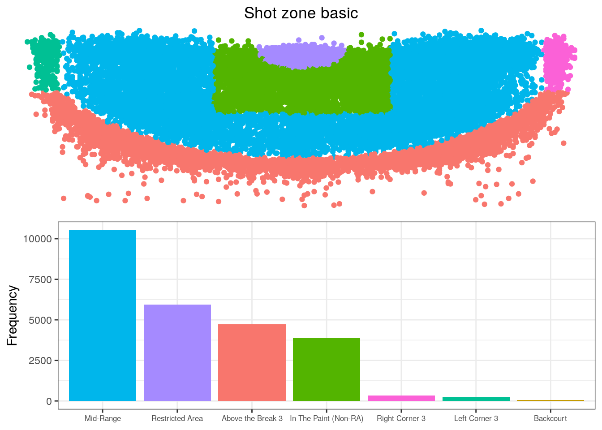
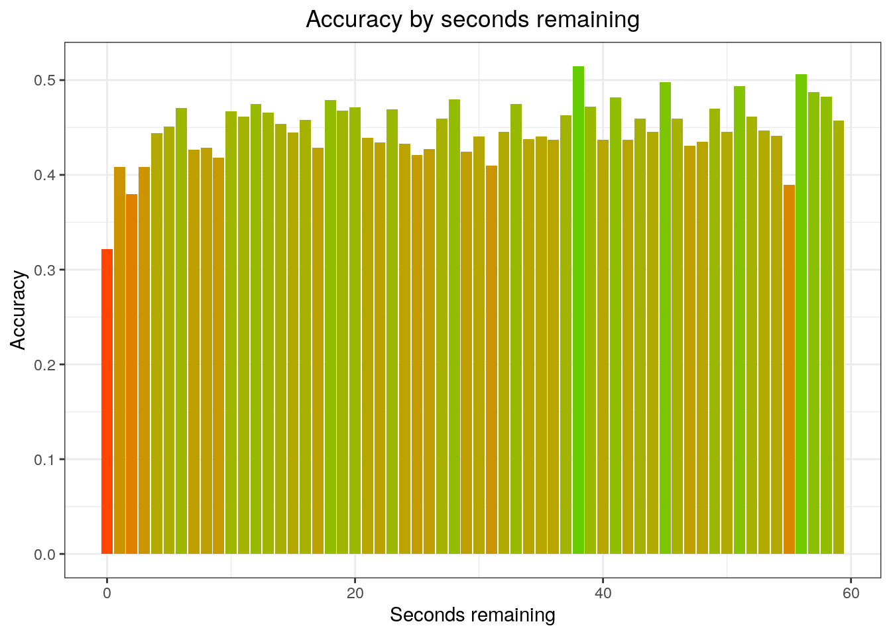

# Kobe Bryant Shot Selection
Analyzing locations and circumstances of every field goal attempted by Kobe Bryant during his 20-year career.

## 1 - Introduction

I am a big fan of basketball, and in this entry we are going to analyze a data set from Kaggle containing the location and circumstances of every field goal attempted by Kobe Bryant took during his 20-year career. We are going to use the [tidyverse](https://cran.r-project.org/web/packages/tidyverse/index.html) package for data manipulation, exploration and visualization. Some context information (Reference [here](https://en.wikipedia.org/wiki/Kobe_Bryant)):

> *Kobe Bean Bryant (born August 23, 1978) is an American former professional basketball player. He played his entire 20-year career with the Los Angeles Lakers of the National Basketball Association (NBA). He entered the NBA directly from high school and won five NBA championships with the Lakers. Bryant is an 18-time All-Star, 15-time member of the All-NBA Team, and 12-time member of the All-Defensive team. He led the NBA in scoring during two seasons and ranks third on the league’s all-time regular season scoring and fourth on the all-time postseason scoring list. He holds the NBA record for the most seasons playing with one franchise for an entire career and is widely regarded as one of the greatest basketball players of all time. Bryant is the first guard in NBA history to play at least 20 seasons.*

## 2 - Loading Data

```R
# Load libraries
library(tidyverse)
library(gridExtra)
library(knitr)

# Read the stats
shots <- read.csv("data.csv")
```

Let's get an idea of what we’re working with.

```R
# Structure
str(shots)
```

```R
## 'data.frame':    30697 obs. of  25 variables:
##  $ action_type       : Factor w/ 57 levels "Alley Oop Dunk Shot",..: 27 27 27 27 6 27 28 27 27 42 ...
##  $ combined_shot_type: Factor w/ 6 levels "Bank Shot","Dunk",..: 4 4 4 4 2 4 5 4 4 4 ...
##  $ game_event_id     : int  10 12 35 43 155 244 251 254 265 294 ...
##  $ game_id           : int  20000012 20000012 20000012 20000012 20000012 20000012 20000012 20000012 20000012 20000012 ...
##  $ lat               : num  34 34 33.9 33.9 34 ...
##  $ loc_x             : int  167 -157 -101 138 0 -145 0 1 -65 -33 ...
##  $ loc_y             : int  72 0 135 175 0 -11 0 28 108 125 ...
##  $ lon               : num  -118 -118 -118 -118 -118 ...
##  $ minutes_remaining : int  10 10 7 6 6 9 8 8 6 3 ...
##  $ period            : int  1 1 1 1 2 3 3 3 3 3 ...
##  $ playoffs          : int  0 0 0 0 0 0 0 0 0 0 ...
##  $ season            : Factor w/ 20 levels "1996-97","1997-98",..: 5 5 5 5 5 5 5 5 5 5 ...
##  $ seconds_remaining : int  27 22 45 52 19 32 52 5 12 36 ...
##  $ shot_distance     : int  18 15 16 22 0 14 0 2 12 12 ...
##  $ shot_made_flag    : int  NA 0 1 0 1 0 1 NA 1 0 ...
##  $ shot_type         : Factor w/ 2 levels "2PT Field Goal",..: 1 1 1 1 1 1 1 1 1 1 ...
##  $ shot_zone_area    : Factor w/ 6 levels "Back Court(BC)",..: 6 4 3 5 2 4 2 2 4 2 ...
##  $ shot_zone_basic   : Factor w/ 7 levels "Above the Break 3",..: 5 5 5 5 6 5 6 6 3 3 ...
##  $ shot_zone_range   : Factor w/ 5 levels "16-24 ft.","24+ ft.",..: 1 3 1 1 5 3 5 5 3 3 ...
##  $ team_id           : int  1610612747 1610612747 1610612747 1610612747 1610612747 1610612747 1610612747 1610612747 1610612747 1610612747 ...
##  $ team_name         : Factor w/ 1 level "Los Angeles Lakers": 1 1 1 1 1 1 1 1 1 1 ...
##  $ game_date         : Factor w/ 1559 levels "1996-11-03","1996-11-05",..: 311 311 311 311 311 311 311 311 311 311 ...
##  $ matchup           : Factor w/ 74 levels "LAL @ ATL","LAL @ BKN",..: 29 29 29 29 29 29 29 29 29 29 ...
##  $ opponent          : Factor w/ 33 levels "ATL","BKN","BOS",..: 26 26 26 26 26 26 26 26 26 26 ...
##  $ shot_id           : int  1 2 3 4 5 6 7 8 9 10 ...
```

```R
# Summary
summary(shots)
```

```R
##                action_type    combined_shot_type game_event_id  
##  Jump Shot           :18880   Bank Shot:  141    Min.   :  2.0  
##  Layup Shot          : 2567   Dunk     : 1286    1st Qu.:110.0  
##  Driving Layup Shot  : 1978   Hook Shot:  153    Median :253.0  
##  Turnaround Jump Shot: 1057   Jump Shot:23485    Mean   :249.2  
##  Fadeaway Jump Shot  : 1048   Layup    : 5448    3rd Qu.:368.0  
##  Running Jump Shot   :  926   Tip Shot :  184    Max.   :659.0  
##  (Other)             : 4241                                     
##     game_id              lat            loc_x              loc_y       
##  Min.   :20000012   Min.   :33.25   Min.   :-250.000   Min.   :-44.00  
##  1st Qu.:20500077   1st Qu.:33.88   1st Qu.: -68.000   1st Qu.:  4.00  
##  Median :20900354   Median :33.97   Median :   0.000   Median : 74.00  
##  Mean   :24764066   Mean   :33.95   Mean   :   7.111   Mean   : 91.11  
##  3rd Qu.:29600474   3rd Qu.:34.04   3rd Qu.:  95.000   3rd Qu.:160.00  
##  Max.   :49900088   Max.   :34.09   Max.   : 248.000   Max.   :791.00  
##                                                                        
##       lon         minutes_remaining     period         playoffs     
##  Min.   :-118.5   Min.   : 0.000    Min.   :1.000   Min.   :0.0000  
##  1st Qu.:-118.3   1st Qu.: 2.000    1st Qu.:1.000   1st Qu.:0.0000  
##  Median :-118.3   Median : 5.000    Median :3.000   Median :0.0000  
##  Mean   :-118.3   Mean   : 4.886    Mean   :2.519   Mean   :0.1466  
##  3rd Qu.:-118.2   3rd Qu.: 8.000    3rd Qu.:3.000   3rd Qu.:0.0000  
##  Max.   :-118.0   Max.   :11.000    Max.   :7.000   Max.   :1.0000  
##                                                                     
##      season      seconds_remaining shot_distance   shot_made_flag 
##  2005-06: 2318   Min.   : 0.00     Min.   : 0.00   Min.   :0.000  
##  2008-09: 2242   1st Qu.:13.00     1st Qu.: 5.00   1st Qu.:0.000  
##  2002-03: 2241   Median :28.00     Median :15.00   Median :0.000  
##  2007-08: 2153   Mean   :28.37     Mean   :13.44   Mean   :0.446  
##  2009-10: 2080   3rd Qu.:43.00     3rd Qu.:21.00   3rd Qu.:1.000  
##  2001-02: 2028   Max.   :59.00     Max.   :79.00   Max.   :1.000  
##  (Other):17635                                     NA's   :5000   
##           shot_type                   shot_zone_area 
##  2PT Field Goal:24271   Back Court(BC)       :   83  
##  3PT Field Goal: 6426   Center(C)            :13455  
##                         Left Side Center(LC) : 4044  
##                         Left Side(L)         : 3751  
##                         Right Side Center(RC): 4776  
##                         Right Side(R)        : 4588  
##                                                      
##               shot_zone_basic         shot_zone_range    team_id         
##  Above the Break 3    : 5620   16-24 ft.      :8315   Min.   :1.611e+09  
##  Backcourt            :   71   24+ ft.        :6275   1st Qu.:1.611e+09  
##  In The Paint (Non-RA): 4578   8-16 ft.       :6626   Median :1.611e+09  
##  Left Corner 3        :  280   Back Court Shot:  83   Mean   :1.611e+09  
##  Mid-Range            :12625   Less Than 8 ft.:9398   3rd Qu.:1.611e+09  
##  Restricted Area      : 7136                          Max.   :1.611e+09  
##  Right Corner 3       :  387                                             
##               team_name          game_date            matchup     
##  Los Angeles Lakers:30697   2016-04-13:   50   LAL @ SAS  : 1020  
##                             2002-11-07:   47   LAL vs. SAS:  936  
##                             2006-01-22:   46   LAL @ SAC  :  889  
##                             2006-12-29:   45   LAL vs. HOU:  878  
##                             2007-03-30:   44   LAL @ DEN  :  873  
##                             2008-01-14:   44   LAL @ PHX  :  859  
##                             (Other)   :30421   (Other)    :25242  
##     opponent        shot_id     
##  SAS    : 1978   Min.   :    1  
##  PHX    : 1781   1st Qu.: 7675  
##  HOU    : 1666   Median :15349  
##  SAC    : 1643   Mean   :15349  
##  DEN    : 1642   3rd Qu.:23023  
##  POR    : 1539   Max.   :30697  
##  (Other):20448
```

## 3 - Data Analysis

### 3.1 - Shot Type

```R
# Shot type
ggplot() + 
  # We use a different alpha value for jump shots to improve the visualization
  geom_point(data=shots %>% filter(combined_shot_type=="Jump Shot"),
             aes(x=lon, y=lat), colour="grey", alpha=0.3) +
  geom_point(data=shots %>% filter(combined_shot_type!="Jump Shot"),
             aes(x=lon, y=lat, colour=combined_shot_type), alpha=0.8) +
  labs(title="Shot type") +
  ylim(c(33.7, 34.0883)) +
  theme_void() +
  theme(legend.title=element_blank(),
        plot.title=element_text(hjust=0.5))
```


As we see, most points in the visualization correspond to jump shots.

### 3.2 - Shot Zone

```R
# Shot zone range
p1 <- ggplot(shots, aes(x=lon, y=lat)) +
  geom_point(aes(color=shot_zone_range)) +
  labs(title="Shot zone range") +
  ylim(c(33.7, 34.0883)) +
  theme_void() +
  theme(legend.position="none",
        plot.title=element_text(hjust=0.5)) 

# Frequency for each shot zone range
p2 <- ggplot(shots, aes(x=fct_infreq(shot_zone_range))) + 
  geom_bar(aes(fill=shot_zone_range)) +
  labs(y="Frequency") +
  theme_bw() +
  theme(axis.title.x=element_blank(), 
        legend.position="none")

# Subplot
grid.arrange(p1, p2, layout_matrix=cbind(c(1,2)))
```


```R
# Shot zone area
p3 <- ggplot(shots, aes(x=lon, y=lat)) +
  geom_point(aes(colour=shot_zone_area)) +
  labs(title="Shot zone area") +
  ylim(c(33.7, 34.0883)) +
  theme_void() +
  theme(legend.position="none",
        plot.title=element_text(hjust=0.5)) 

# Frequency for each shot zone area
p4 <- ggplot(shots, aes(x=fct_infreq(shot_zone_area))) + 
  geom_bar(aes(fill=shot_zone_area)) +
  labs(y="Frequency") +
  theme_bw() +
  theme(axis.text.x=element_text(size=7),
        axis.title.x=element_blank(), 
        legend.position="none")

# Subplot
grid.arrange(p3, p4, layout_matrix=cbind(c(1,2)))
```


```R
# Shot zone basic
p5 <- ggplot(shots, aes(x=lon, y=lat)) +
  geom_point(aes(color=shot_zone_basic)) +
  labs(title="Shot zone basic") +
  ylim(c(33.7, 34.0883)) +
  theme_void() +
  theme(legend.position="none",
        plot.title=element_text(hjust=0.5))

# Frequency for each shot zone basic
p6 <- ggplot(shots, aes(x=fct_infreq(shot_zone_basic))) + 
  geom_bar(aes(fill=shot_zone_basic)) +
  labs(y="Frequency") +
  theme_bw() +
  theme(axis.text.x=element_text(size=6.3),
        axis.title.x=element_blank(), 
        legend.position="none")

# Subplot
grid.arrange(p5, p6, layout_matrix=cbind(c(1,2)))
```



### 3.3 - Shot Accuracy

```R
# Accuracy by shot type 
shots %>%
  group_by(action_type) %>%
  summarise(Accuracy=mean(shot_made_flag),
            counts=n()) %>%
  filter(counts>20) %>%
  ggplot(aes(x=reorder(action_type, Accuracy), y=Accuracy)) + 
  geom_point(aes(colour=Accuracy), size=3) +
  scale_colour_gradient(low="orangered", high="chartreuse3") +
  labs(title="Accuracy by shot type") +
  theme_bw() +
  theme(axis.title.y=element_blank(),
        legend.position="none",
        plot.title=element_text(hjust=0.5)) +
  coord_flip()
```


```R
# Accuracy by season
shots %>%
  group_by(season) %>%
  summarise(Accuracy=mean(shot_made_flag)) %>%
  ggplot(aes(x=season, y=Accuracy, group=1)) +
  geom_line(aes(colour=Accuracy)) +
  geom_point(aes(colour=Accuracy), size=3) +
  scale_colour_gradient(low="orangered", high="chartreuse3") +
  labs(title="Accuracy by season", x="Season") +
  theme_bw() +
  theme(legend.position="none",
        axis.text.x=element_text(angle=45, hjust=1),
        plot.title=element_text(hjust=0.5)) 
```


As we see, the accuracy begins to decrease badly from the 2013-14 season. Why didn't you retire before, Kobe?

```R
# Accuracy by season in Playoff and Regular Season
shots %>%
  group_by(season) %>%
  summarise(Playoff=mean(shot_made_flag[playoffs==1]),
            RegularSeason=mean(shot_made_flag[playoffs==0])) %>%
  ggplot(aes(x=season, group=1)) +
  geom_line(aes(y=Playoff, colour="Playoff")) +
  geom_line(aes(y=RegularSeason, colour="RegularSeason")) +
  geom_point(aes(y=Playoff, colour="Playoff"), size=3) +
  geom_point(aes(y=RegularSeason, colour="RegularSeason"), size=3) +
  labs(title="Accuracy by season", 
       subtitle="Playoff and Regular Season",
       x="Season", y="Accuracy") +
  theme_bw() +
  theme(legend.title=element_blank(),
        legend.position="bottom",
        axis.text.x=element_text(angle=45, hjust=1),
        plot.title=element_text(hjust=0.5),
        plot.subtitle=element_text(hjust=0.5))
```


Notice that the red line is discontinuous because in some seasons the Lakers couldn't make the NBA playoffs.

```R
# Accuracy by season in 2PT Field Goal and 3PT Field Goal
shots %>%
  group_by(season) %>%
  summarise(TwoPoint=mean(shot_made_flag[shot_type=="2PT Field Goal"]),
            ThreePoint=mean(shot_made_flag[shot_type=="3PT Field Goal"])) %>%
  ggplot(aes(x=season, group=1)) +
  geom_line(aes(y=TwoPoint, colour="TwoPoint")) +
  geom_line(aes(y=ThreePoint, colour="ThreePoint")) +
  geom_point(aes(y=TwoPoint, colour="TwoPoint"), size=3) +
  geom_point(aes(y=ThreePoint, colour="ThreePoint"), size=3) +
  labs(title="Accuracy by season", 
       subtitle="2PT Field Goal and 3PT Field Goal",
       x="Season", y="Accuracy") +
  theme_bw() +
  theme(legend.title=element_blank(),
        legend.position="bottom",
        axis.text.x=element_text(angle=45, hjust=1),
        plot.title=element_text(hjust=0.5),
        plot.subtitle=element_text(hjust=0.5))
```


What the hell happened in the 2013-2014 season? That 3P% is extremely low! This could be a factor that contributed to the Lakers not making the playoffs that year.

```R
# Accuracy by shot distance
shots %>%
  group_by(shot_distance) %>%
  summarise(Accuracy=mean(shot_made_flag)) %>%
  ggplot(aes(x=shot_distance, y=Accuracy)) + 
  geom_line(aes(colour=Accuracy)) +
  geom_point(aes(colour=Accuracy), size=2) +
  scale_colour_gradient(low="orangered", high="chartreuse3") +
  labs(title="Accuracy by shot distance", x="Shot distance (ft.)") +
  xlim(c(0,45)) +
  theme_bw() +
  theme(legend.position="none",
        plot.title=element_text(hjust=0.5))
```


```R
# Accuracy by shot zone range
p7 <- shots %>%
  select(lat, lon, shot_zone_range, shot_made_flag) %>%
  group_by(shot_zone_range) %>%
  mutate(Accuracy=mean(shot_made_flag)) %>%
  ggplot(aes(x=lon, y=lat)) +
  geom_point(aes(colour=Accuracy)) +
  scale_colour_gradient(low="red", high="lightgreen") +
  labs(title="Accuracy by shot zone range") +
  ylim(c(33.7, 34.0883)) +
  theme_void() +
  theme(plot.title=element_text(hjust=0.5))

# Accuracy by shot zone area
p8 <- shots %>%
  select(lat, lon, shot_zone_area, shot_made_flag) %>%
  group_by(shot_zone_area) %>%
  mutate(Accuracy=mean(shot_made_flag)) %>%
  ggplot(aes(x=lon, y=lat)) +
  geom_point(aes(colour=Accuracy)) +
  scale_colour_gradient(low="red", high="lightgreen") +
  labs(title="Accuracy by shot zone area") +
  ylim(c(33.7, 34.0883)) +
  theme_void() +
  theme(legend.position="none",
        plot.title=element_text(hjust=0.5))

# Accuracy by shot zone basic
p9 <- shots %>%
  select(lat, lon, shot_zone_basic, shot_made_flag) %>%
  group_by(shot_zone_basic) %>%
  mutate(Accuracy=mean(shot_made_flag)) %>%
  ggplot(aes(x=lon, y=lat)) +
  geom_point(aes(colour=Accuracy)) +
  scale_colour_gradient(low="red", high="lightgreen") +
  labs(title="Accuracy by shot zone basic") +
  ylim(c(33.7, 34.0883)) +
  theme_void() +
  theme(legend.position="none",
        plot.title=element_text(hjust=0.5))

# Subplots
grid.arrange(p7, p8, p9, layout_matrix=cbind(c(1,2), c(1,3)))
```


```R
# Accuracy by minutes remaining
shots %>%
  group_by(minutes_remaining) %>%
  summarise(Accuracy=mean(shot_made_flag)) %>%
  ggplot(aes(x=minutes_remaining, y=Accuracy)) + 
  geom_bar(aes(fill=Accuracy), stat="identity") +
  scale_fill_gradient(low="orangered", high="chartreuse3") +
  labs(title="Accuracy by minutes remaining", x="Minutes remaining")  +
  theme_bw() +
  theme(legend.position="none",
        plot.title=element_text(hjust=0.5))
```


```R
# Accuracy by seconds remaining
shots %>%
  group_by(seconds_remaining) %>%
  summarise(Accuracy=mean(shot_made_flag)) %>%
  ggplot(aes(x=seconds_remaining, y=Accuracy)) + 
  geom_bar(aes(fill=Accuracy), stat="identity") +
  scale_fill_gradient(low="orangered", high="chartreuse3") +
  labs(title="Accuracy by seconds remaining", x="Seconds remaining")  +
  theme_bw() +
  theme(legend.position="none",
        plot.title=element_text(hjust=0.5))
```



```R
# Accuracy by opponent
shots %>%
  group_by(opponent) %>%
  summarise(Accuracy=mean(shot_made_flag)) %>%
  mutate(Conference=c("Eastern", "Eastern", "Eastern", "Eastern", "Eastern",
                      "Eastern", "Western", "Western", "Eastern", "Western",
                      "Western", "Eastern", "Western", "Western", "Eastern",
                      "Eastern", "Western", "Eastern", "Western", "Western",
                      "Eastern", "Western", "Eastern", "Eastern", "Western",
                      "Western", "Western", "Western", "Western", "Eastern",
                      "Western", "Western", "Eastern" )) %>%
  ggplot(aes(x=reorder(opponent, -Accuracy), y=Accuracy)) + 
  geom_bar(aes(fill=Conference), stat="identity") +
  labs(title="Accuracy by opponent", x="Opponent") +
  theme_bw() +
  theme(legend.position="bottom",
        legend.title=element_blank(),
        axis.text.x=element_text(angle=45, hjust=1),
        plot.title=element_text(hjust=0.5))
```


```R
# Accuracy by opponent in 2PT Field Goal and 3PT Field Goal
shots %>%
  group_by(opponent) %>%
  summarise(TwoPoint=mean(shot_made_flag[shot_type=="2PT Field Goal"]),
            ThreePoint=mean(shot_made_flag[shot_type=="3PT Field Goal"])) %>%
  ggplot(aes(x=opponent, group=1)) +
  geom_line(aes(y=TwoPoint, colour="TwoPoint")) +
  geom_line(aes(y=ThreePoint, colour="ThreePoint")) +
  geom_point(aes(y=TwoPoint, colour="TwoPoint"), size=3) +
  geom_point(aes(y=ThreePoint, colour="ThreePoint"), size=3) +
  labs(title="Accuracy by opponent", 
       subtitle="2PT Field Goal and 3PT Field Goal",
       x="Opponent", y="Accuracy") +
  theme_bw() +
  theme(legend.title=element_blank(),
        legend.position="bottom",
        axis.text.x=element_text(angle=45, hjust=1),
        plot.title=element_text(hjust=0.5),
        plot.subtitle=element_text(hjust=0.5))
```


## 4 - Summary

It seems that the Lakers have tumbled from dynasty to disaster as Kobe Bryant's career wound down. Is it possible to make the Lakers great again? Maybe with the arrival of Lebron James? (UPDATE: Lebron plays now with Los Angeles Lakers, and also Anthony Davis!). We will see, but Magic (UPDATE: Magic Johnson left Lakers front office job) please don't sign LiAngelo or LaMelo Ball, I beg you.
